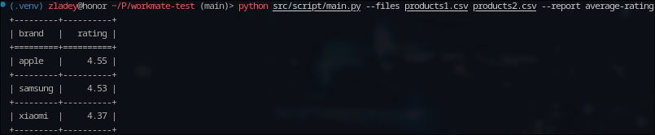

В некоторых моментах перемудрил, но не хочется искать более лаконичное решение чтобы быстрее сдать задание.
Новый отчёт добавляется с помощью добавления в переменную report_types названия отчёта в формате <Название функции для агрегации>-<Поле к которому будет применяться функция> и написания самой функции соответственно (если в самом питоне нет необходимой, min и max можно указывать прямо так)
Для изменения поля по которому будет происходить группировка придётся изменять функцию main(), вместе с этим отчёт может содержать только два столбца, так как реализация для нескольких стобцов сложнее и дольше (лучшим способом было бы хранить такие данные в SQL базе данных, где это делается проще с помощью group by и join`ов)
Пример запуска скрипта:
